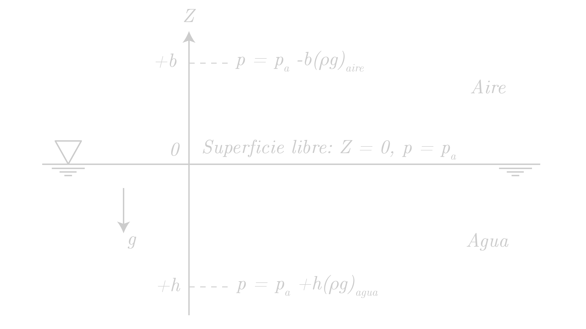

Los líquidos son tan incompresibles que podemos despreciar la variación de su densidad hidroestática. Por eso supondremos que la densidad es constante en estos casos.  En los lagos y océanos, el sistema de coordenadas utilizado habitualmente es el de la figura 1, con \\( z = 0 \\) en la superficie libre, donde \\( p \\) tiene el valor de la presion atmosférica \\( p_a \\). Al introducir esto en la ecuación siguiente tendremos, para el valor \\( p \\) de la presión a una profuncdidad \\( z \\) (de valor negativo).

$$ p_2 - p_1 = - \rho g (z_2 -z_1) $$

donde \\( \rho g \\) es el peso específico medio en el océano o lago. Como veremos, la ecuación es válida también en los niveles más bajos de la atmósfera , con un error del 2 por 100 a 300 m de altura.

# Ejemplo

