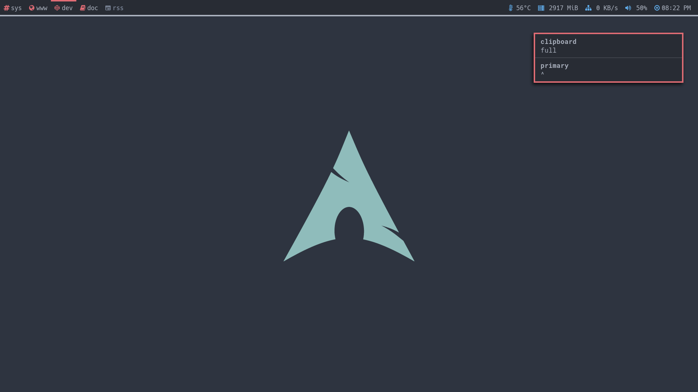

[Dunst](https://github.com/dunst-project/dunst) es un programa sencillo y ligero que ofrece notificaciones en entornos *Linux* con un nivel de personalización bastante alto. Uno de los usos que se me ocurrió nada más descubrir este programa es mostrar los contenidos del portapapeles. El procedimiento es simple, transmitir el output de `xlip` tanto para el portapapeles del sistema (clipboard) como al primario (primary) a una notificación de escritorio mediante `notify-send`.

Las dependencias que necesitaremos instalar previamente son las siguientes.

- **notify-send** - Envía la notificación de escritorio.
- **xclip** - Gestiona el portatapeles. Forma parte del popular *display server* [xorg](https://wiki.archlinux.org/title/xorg)
- **dunst** - Daemon que recibe las notificaciones y las muestra en pantalla.

Una vez todas las dependencias estén instaladas, se puede ejecutar el script de *Bash*  sin problemas. Recuerda, que primero hay que hacer ejecutable al archivo.

```bash
#!/bin/sh

clip=$(xclip -o -selection clipboard)
prim=$(xclip -o -selection primary)

[ -n "$clip" ] && notify-send "clipboard" "$clip"
[ -n "$prim" ] && notify-send "primary" "$prim"
```

Una manera de mejorar está función es enlazar el *script* a un atajo de teclado. En mi caso lo tengo configurado para `SUPER + F1`