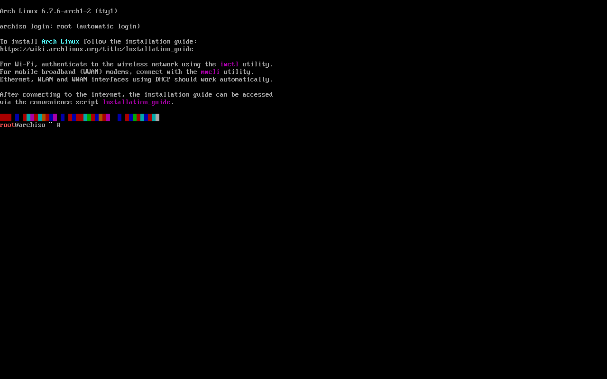

First, download the [ISO](https://archlinux.org/download/) file from the Archlinux webpage and create a bootable USB drive with [Rufus](https://rufus.ie). When finished, reboot your computer and wait for your motherboard logo on screen. Press `F11` key and choose to boot from your attached USB drive. After loading, a root prompt will be displayed.



Set the console keyboard layout. 

```bash
loadkeys es
```

Verify connection with `ping`.

```bash
ping -c 3 archlinux.org
```

Partition the disk into `boot` and `root`.

```bash
fdisk -l
fdisk /dev/sda
```

Create a new empty `GPT` partition table with `g` and then add the following partitions with `n`. Then write the table to disk and exit with `w`.

| Mount point | Partition | Partition type         | Size      |
| ----------- | --------- | ---------------------- | --------- |
| /mnt/boot   | /dev/sda1 | 1 (EFI System)         | 512M      |
| /mnt        | /dev/sda2 | 23 (Linux x86-64 root) | Remainder |

Format the newly created partitions.

```bash
mkfs.fat -F 32 /dev/sda1
mkfs.ext4 /dev/sda2
```

Mount the file system.

```bash
mount /dev/sda2 /mnt
mount --mkdir /dev/sda1 /mnt/boot
```

Install esential packages onto the mounted drive.

```bash
pacstrap -K /mnt \
	base
	base-devel
	linux
	linux-firmware
	amd-ucode # for amd cpus
	efibootmgr
	neovim
	man-db
	networkmanager
	sudo
	zsh
```

Generate `fstab` file.

```bash
genfstab -U /mnt >> /mnt/etc/fstab
```

Change `root` into the new system.

```bash
arch-chroot /mnt
```

Set the time zone.

```bash
ln -sf /usr/share/zoneinfo/Europe/Madrid /etc/localtime
```

Generate `/etc/adjtime`.

```bash
hwclock --systohc
```

Generate `UTF-8`locales uncommenting the desired line.

```bash
nvim /etc/locale.gen
locale-gen
```

Set `LANG` variable.

```bash
echo "LANG=en_GB.UTF-8" >> /etc/locale.conf
```

Set console keyboard layout

```bash
echo "KEYMAP=es" >> /etc/vconsole.conf
```

Set `hostname`

```bash
echo "archie" >> /etc/hostname
```

Enable network management

```bash
systemctl enable NetworkManager.service
```

Update  `initramfs`

```bash
mkinitcpio -P
```

Set root password

```bash
passwd
```

Create unprivileged user

```
useradd -m -G wheel -s /usr/bin/zsh me
```

Set password for unprivileged user

```bash
passwd me
```

Allow members of group *wheel* `sudo` access

```
EDITOR=nvim visudo
```

Check `UUID` of root partition `/dev/sda2`

```
blkid -s UUID -o value /dev/sda2
```

Create a boot entry

```bash
efibootmgr
	--create
	--disk /dev/sda
	--part 1
	--label "Archlinux" \
	--loader /vmlinuz-linux \
	--unicode 'root=UUID=01a40dd8-28f0-4636-be1e-aeed60c98095 rw initrd=\amd-ucode.img initrd=\initramfs-linux.img'
```

Delete previous entries

```bash
efibootmgr -v 
efibootmgr -b 000X -B
```

Exit mounted system

```bash
exit
umount -R /mnt
reboot
```